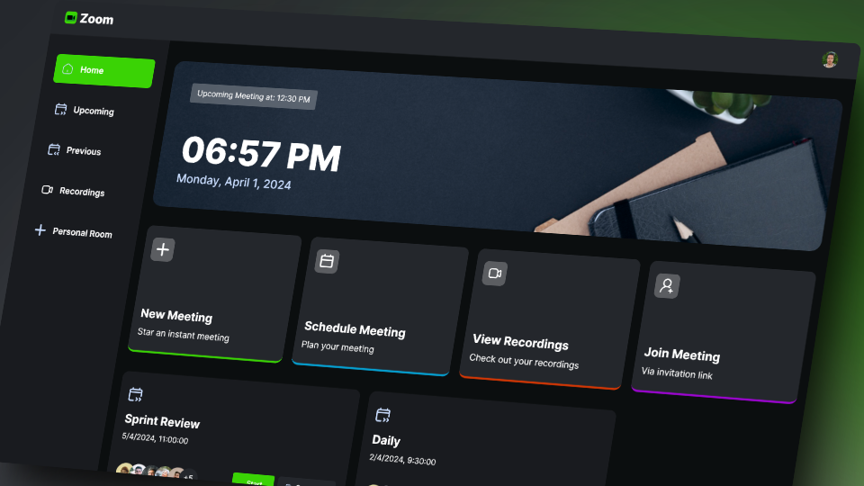
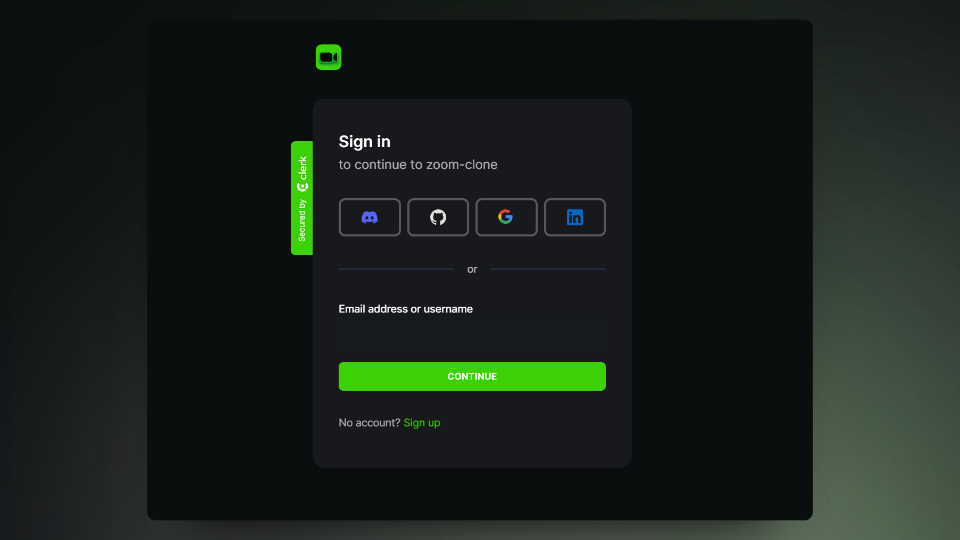
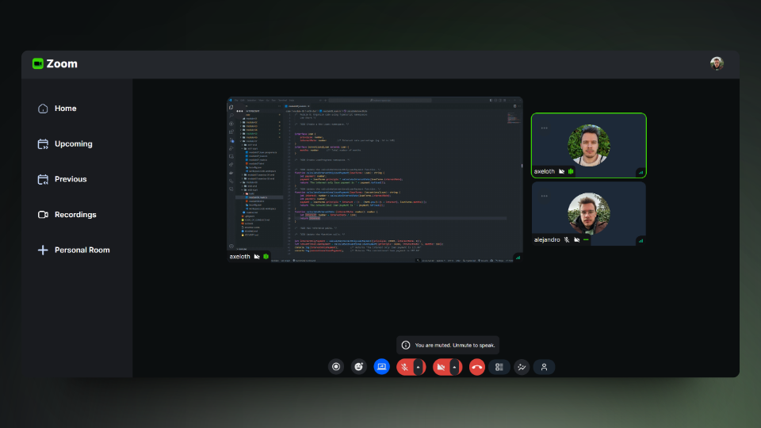
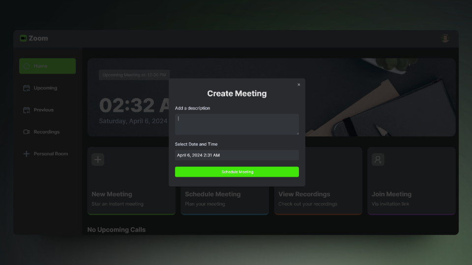

   
    
   
  

# Zoom Clone - Next.js 14, Typescript, TailwindCSS, Getstream, Clerk

https://al-zoom-clone.onrender.com/

Built with the latest Next.js and TypeScript, this project replicates Zoom, a widely used video conferencing tool. It enables users to securely log in, create meetings and access various meeting functionalities such as recording, screen sharing, and managing participants.

## Tech Stack

- [Next.js](https://nextjs.org/) - React framework for server-side rendering and static site generation
- [TypeScript](https://www.typescriptlang.org/) - Typed superset of JavaScript
- [Clerk](https://clerk.dev/) - User authentication and identity management
- [Getstream](https://getstream.io/) - API for building scalable and customizable chat/video applications
- [Shadcn/UI](https://shadcn.com/ui) - Component library for building user interfaces
- [Tailwind CSS](https://tailwindcss.com/) - Utility-first CSS framework

## Features

🔒 **Authentication**: Implements authentication and authorization features using Clerk, allowing users to securely log in via social sign-on or traditional email and password methods, while ensuring appropriate access levels and permissions within the platform.

📹 **New Meeting**: Quickly start a new meeting, configuring camera and microphone settings before joining.

🎛️ **Meeting Controls**: Participants have full control over meeting aspects, including recording, reaction emojis, screen sharing, muting/unmuting, sound adjustments, grid layout, participant list view, and individual participant management (pinning, muting, unmuting, blocking, allowing video share).

🚪 **Exit Meeting**: Participants can leave a meeting, or creators can end it for all attendees.

📅 **Schedule Future Meetings**: Input meeting details (date, time) to schedule future meetings, accessible on the 'Upcoming Meetings' page for sharing the link or immediate start.

📜 **Past Meetings List**: Access a list of previously held meetings, including details and metadata.

📼 **View Recorded Meetings**: Access recordings of past meetings for review or reference.

🏠 **Personal Room**: Users have a personal room with a unique meeting link for instant meetings, shareable with others.

🔗 **Join Meetings via Link**: Easily join meetings created by others by providing a link.

🔐 **Secure Real-time Functionality**: All interactions within the platform are secure and occur in real-time, maintaining user privacy and data integrity.

📱 **Responsive Design**: Follows responsive design principles to ensure optimal user experience across devices, adapting seamlessly to different screen sizes and resolutions.

And more, including code architecture and reusability.

